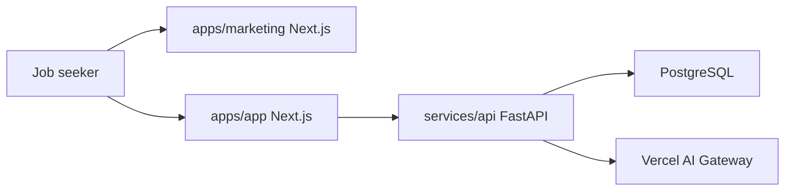
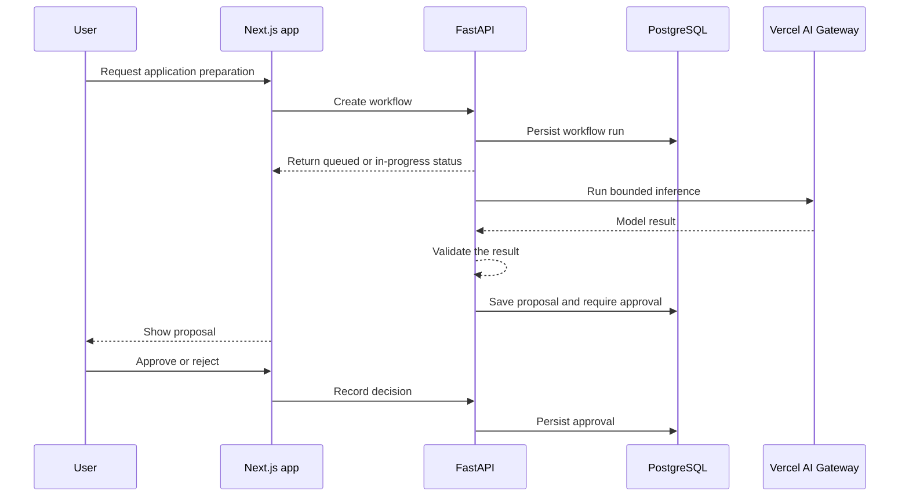

# cAIreer Technology Map

This document is the shared technical reference for cAIreer. Read it before making architectural or dependency decisions. Update it when a decision changes.

## Status legend

- **Confirmed**: explicitly chosen for the project.
- **Proposed**: the current default unless implementation evidence suggests a better choice.
- **Undecided**: do not silently choose; record the decision here when it becomes necessary.

## Product boundary

The initial validation release is a cinematic public launch website for ambitious students and early-career professionals who already use AI in their job search. It introduces cAIreer's worldview and product promise to the market, explains the intended experience, captures early-access interest, and recruits potential research participants before further product infrastructure is built.

The first functional product release serves job seekers. It helps them discover and evaluate jobs, prepare tailored application material, and automate repetitive steps while keeping them in control of how they are represented.

Applying, sending outreach, or performing another consequential external action always requires an explicit human approval record.

Employer-side agents negotiating directly with candidate agents are a later product stage, not an MVP dependency.

## System map



The central idea is **separation of responsibilities**:

- `apps/marketing` owns the public website. It can ship without product login or the Python API.
- `apps/app` owns the signed-in product UI. It talks to `services/api`. It is not the marketing site.
- `services/api` owns every inference call, including evaluation requests. Its initial model endpoint is `POST /internal/models/evaluate`; trusted evaluation scripts call it over HTTP. The product app never sees the provider wire.
- `packages/ui` owns shared shadcn/ui components used by both Next.js apps.
- PostgreSQL owns durable business state.

These are separate programs in one repo. They share UI primitives, not a deploy or a database connection.

Do not add Redis, object storage, or extra workers until a real feature needs them.

## Monorepo tooling

| Tool | Job |
|---|---|
| pnpm | Install JavaScript dependencies and link local packages from each `package.json` |
| uv | Install Python dependencies for `services/api` |
| Turborepo (`turbo`) | Run `dev`, `build`, `lint`, and `typecheck` across packages, in dependency order, with cache |
| shadcn/ui CLI | Add components into `packages/ui`. It does not run the terminal |
| Turbopack | Next.js bundler inside `next dev` / `next build`. Not the `turbo` CLI |

`pnpm install` fills `node_modules`. `pnpm dev` is `turbo dev`. See [0003](docs/decisions/0003-two-apps-python-backend.md) and [0004](docs/decisions/0004-turborepo-task-runner.md).

## Technology decisions

| Area | Choice | Status | Responsibility |
|---|---|---|---|
| Marketing UI | Next.js App Router, React, TypeScript | Confirmed | Public site, waitlist interface |
| Product UI | Next.js App Router, React, TypeScript | Confirmed | Signed-in product screens |
| Product API | Python FastAPI | Confirmed | Authenticated product operations and durable writes |
| Styling | Tailwind CSS | Confirmed | Responsive styling and design tokens |
| UI components | shadcn/ui in `packages/ui` | Confirmed | Shared accessible components |
| Additional UI library | Not selected | Undecided | Add only if shadcn/ui cannot cover a specific need |
| Primary database | PostgreSQL | Confirmed | Users, profiles, jobs, applications, approvals, workflow state |
| Python database access | Not selected | Undecided | Schema, migrations, and queries in the API |
| Agent orchestration | Python with Pydantic AI in `services/api` | Confirmed | Agent tools, structured output, guardrails, decisions |
| Inference | Vercel AI Gateway, called from Python only | Confirmed | Only `services/api` calls providers; `evals` and remaining experiment scripts use its HTTP endpoint. See [0005](docs/decisions/0005-python-owns-inference.md) |
| Product UI wire | FastAPI responses | Confirmed | `apps/app` knows product requests and responses. It does not know model ids, gateway URLs, or provider payloads |
| Background work | Not selected | Undecided | Queueing only when a workflow cannot finish in a request |
| File storage | Not selected | Undecided | Resumes and generated documents when needed |
| TypeScript validation | Zod | Proposed | Browser and Next.js boundary validation |
| Python validation | Pydantic | Confirmed | API request, response, and agent-output validation |
| Python testing | pytest | Proposed | Unit and service-contract tests |
| TypeScript testing | Vitest and Playwright | Proposed | Unit, integration, and end-to-end tests |
| Package management | pnpm workspaces | Confirmed | JavaScript/TypeScript install and per-package dependency lists |
| Python packaging | uv | Confirmed | API dependencies and lockfile |
| Task runner | Turborepo | Confirmed | Coordinated `dev` / `build` / `lint` / `typecheck` and cache |
| Local infrastructure | Docker Compose for PostgreSQL | Confirmed | Local database |
| Authentication | Provider not selected | Undecided | Identity, sessions, account recovery |
| Marketing-site hosting | Vercel | Confirmed | Public product website |
| Waitlist storage | Supabase or email-list provider | Undecided | Durable early-access signups and research consent |
| Product hosting | Providers not selected | Undecided | Product web app, API, database, and storage |

## Component ownership

### `apps/marketing` — Next.js

Owns:

- Public product introduction
- Waitlist and research-invitation UI
- Marketing-only server rendering

Must not own:

- Product authentication
- Agent runs
- Durable product records that the API should own

### `apps/app` — Next.js

Owns:

- Signed-in product screens
- Browser-facing product UI state
- Calling `services/api` for product operations
- Showing workflow status and approval decisions

Must not own:

- Direct database writes
- Inference, model ids, provider URLs, or gateway payloads
- Long-running agent loops
- Waiting synchronously for human approval

### `services/api` — Python FastAPI

Owns:

- Product HTTP API, which is the only wire `apps/app` uses
- PostgreSQL access
- Pydantic AI agents, tools, structured outputs, and guardrails
- Calls to Vercel AI Gateway, including the internal typed evaluation endpoint used by model-based evals
- Recording approval decisions and external-action attempts
- Timeouts and API-level errors

Must not own:

- React UI
- Unrestricted shell, browser, or external-account access for an agent

The agent receives narrow tools. It does not receive unrestricted database, shell, browser, or external-account access.

### `packages/ui` — shadcn/ui

Owns shared UI primitives used by both Next.js apps. App-specific screens stay in the app that uses them.

### PostgreSQL

PostgreSQL is the source of truth. Initial domain concepts are:

- `User`
- `CandidateProfile`
- `Experience`
- `Job`
- `Application`
- `ApplicationArtifact`
- `Approval`
- `WorkflowRun`
- `ExternalAction`

These are concepts, not final table definitions. Tables and relationships will be designed alongside the first vertical slices.

## Core application flow



Waiting for approval is a database state such as `awaiting_approval`, not a server process left running.

## Contracts and validation

Validation happens at every trust boundary:

1. Browser input is validated by the Next.js server before it is forwarded.
2. FastAPI validates requests and responses with Pydantic.
3. Database constraints protect durable invariants.
4. Agent tools and outputs use Pydantic models.
5. External data is always treated as untrusted.

Prefer generated or contract-tested TypeScript/Python interfaces over manually duplicated shapes. The exact OpenAPI or schema-generation workflow will be selected when the first cross-language endpoint is built.

## Security and privacy invariants

- Never submit an application, contact a person, or publish content without explicit recorded approval.
- Check authorization on the server; hiding a UI control is not authorization.
- Keep provider keys and credentials out of browser bundles, logs, prompts, and Git.
- Accept provider base URLs only from trusted server-side configuration; never proxy an arbitrary user-supplied URL.
- Send agents and automation only the personal data required for the current operation.
- Keep an audit trail of proposed, approved, attempted, succeeded, and failed external actions.
- Redact sensitive candidate data from routine logs and traces.
- Prefer official APIs over browser automation when a suitable API exists and its terms permit the use case.

## Expected repository structure

```text
apps/
  marketing/            Next.js public website
  app/                  Next.js product UI
services/
  api/                  FastAPI, Pydantic AI, PostgreSQL access
  experiments/          Loose Python scripts for gateway and PDF checks
packages/
  ui/                   shadcn/ui components
  eslint-config/        Shared ESLint config
  typescript-config/    Shared TypeScript config
compose.yaml            Local PostgreSQL
docs/
  decisions/            Architectural decision records when needed
.learning/              Project-local learning state
```

Create directories only when their first real feature needs them. This map is not permission to scaffold unused infrastructure.

## Build order

1. Build a cinematic, minimalist product introduction and launch website for the confirmed early-career audience.
2. Select and connect waitlist storage, add the required privacy wording and basic conversion analytics, then deploy the site to Vercel.
3. Interview and, where practical, manually support early users to test whether the problem and promise are strong enough to justify the functional product.
4. Use the evidence to confirm or revise the first functional workflow before adding more infrastructure.
5. Build and persist a candidate profile.
6. Capture a job and create an application workspace.
7. Model application states and approval transitions.
8. Add one agent inside `services/api`. The API calls Vercel AI Gateway and returns a normal FastAPI response. `apps/app` does not learn the provider format.
9. Connect approval to one carefully bounded external action.
10. Add product hosting, observability, privacy controls, and cost controls as required.

The monorepo exists so later slices have a place to land. New product infrastructure still pauses until website evidence sharpens the first functional workflow.

## Decision rules

- Prefer the smallest architecture that supports the next vertical slice.
- Introduce a dependency because it owns a clear responsibility, not because it is fashionable.
- Keep business rules out of React components and agent prompts when deterministic code can enforce them.
- Treat model output as untrusted input that must be validated and authorised.
- Next.js apps call `services/api` and nothing behind it. Inference and provider wire formats stay in Python. See [0005](docs/decisions/0005-python-owns-inference.md).
- Do not treat `apps/marketing` and `apps/app` as one UI. Marketing stays public and deployable alone.
- Write down significant reversals in `docs/decisions/` and update this map in the same change.
- If implementation and this document disagree, stop and resolve the inconsistency rather than allowing two architectures to coexist accidentally.

## Open decisions

- Waitlist storage provider and its data-retention policy
- Authentication provider
- Python database library and migration tool
- Whether a second UI library is needed
- Hosting providers and regional data location
- Object storage provider
- Email and calendar integrations
- Job-source integrations and their permitted automation methods
- Production monitoring and error-reporting provider
- Data retention and deletion policy
- Logical model purposes, selection policy, and permitted fallback rules
- How future Pydantic AI agents use the API-owned inference client; the initial Jev route uses HTTP directly
- Background queue only if request/response work is no longer enough

## Initial model gateway slice

FastAPI owns `POST /internal/models/evaluate`, with an internal bearer token, server-selected Jev model, a fixed Vercel gateway URL, a 60-second timeout, and sanitized upstream errors. Responses preserve gateway usage and cost metadata. See [API setup and eval example](services/api/README.md). Model-based evals need a running API; deterministic PDF parsing does not. This infrastructure does not integrate an experimental capability into product screens.

Resume evals offer optional sequential grouping through that endpoint. Each line is
a pending candidate until its boundary decision passes validation, then joins the
processed FIFO context. Saved group membership survives context eviction. Request
size currently uses a conservative UTF-8 byte estimate with headroom, not a verified
Jev tokenizer. See [resume eval usage and limits](evals/resume/README.md).
