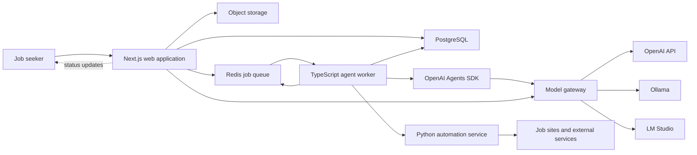
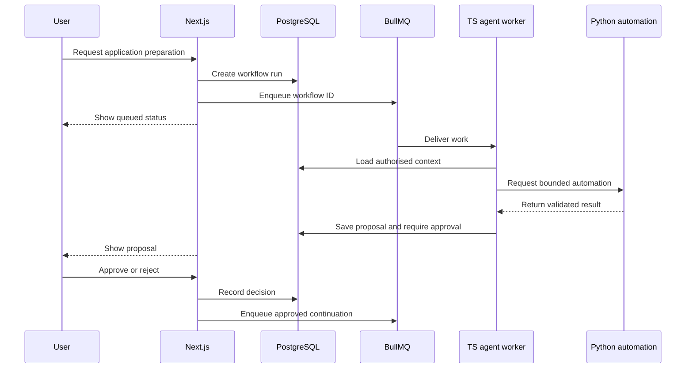

# A2A Hire Technology Map

This document is the shared technical reference for A2A Hire. Read it before making architectural or dependency decisions. Update it when a decision changes.

## Status legend

- **Confirmed**: explicitly chosen for the project.
- **Proposed**: the current default unless implementation evidence suggests a better choice.
- **Undecided**: do not silently choose; record the decision here when it becomes necessary.

## Product boundary

The first release serves job seekers. It helps them discover and evaluate jobs, prepare tailored application material, and automate repetitive steps while keeping them in control of how they are represented.

Applying, sending outreach, or performing another consequential external action always requires an explicit human approval record.

Employer-side agents negotiating directly with candidate agents are a later product stage, not an MVP dependency.

## System map



The central idea is **separation of responsibilities**:

- Next.js owns the user-facing product and normal application API.
- The TypeScript worker owns agent decisions and long-running workflow coordination.
- The model gateway owns every model-provider connection and presents one internal contract.
- Python owns specialised automation execution.
- PostgreSQL owns durable business state.
- Redis transports temporary background work; it is not the source of truth.

## Technology decisions

| Area | Choice | Status | Responsibility |
|---|---|---|---|
| Web UI | Next.js App Router, React, TypeScript | Confirmed | Pages, forms, dashboards, server rendering |
| Product API | Next.js Route Handlers and Server Actions | Confirmed | Authenticated product operations and browser-facing API |
| Styling | Tailwind CSS | Confirmed | Responsive styling and design tokens |
| UI components | shadcn/ui | Proposed | Accessible, reusable interface components when the first interactive form needs them |
| Primary database | PostgreSQL | Proposed | Users, profiles, jobs, applications, approvals, workflow state |
| TypeScript database access | Drizzle ORM | Proposed | Schema, migrations, typed queries |
| Agent orchestration | TypeScript with OpenAI Agents SDK | Confirmed | Agent tools, structured output, guardrails, traces, decisions |
| Model access | Internal TypeScript model gateway | Confirmed | Normalised generation, streaming, tools, structured output, embeddings, capabilities, and errors |
| Initial model providers | OpenAI, Ollama, and LM Studio | Confirmed | Cloud and local inference behind the same internal boundary |
| Background work | Redis and BullMQ | Proposed | Queueing agent workflows, retries, concurrency control |
| Automation API | Python with FastAPI and Pydantic | Confirmed | Typed boundary around Python automation capabilities |
| Browser automation | Python Playwright | Proposed | Browser-based actions where an approved integration is unavailable |
| File storage | S3-compatible object storage | Proposed | Resumes, cover letters, exports, and generated documents |
| TypeScript validation | Zod | Proposed | Request, configuration, tool-input, and agent-output validation |
| Python testing | pytest | Proposed | Unit and service-contract tests |
| TypeScript testing | Vitest and Playwright | Proposed | Unit, integration, and end-to-end tests |
| Package management | pnpm workspaces | Confirmed | Dependency installation and shared scripts across applications and packages |
| Build orchestration | Turborepo | Proposed | Caching and coordinated builds when multiple packages make it worthwhile |
| Local infrastructure | Docker Compose | Proposed | PostgreSQL, Redis, and service development |
| Authentication | Provider not selected | Undecided | Identity, sessions, account recovery |
| Hosting | Providers not selected | Undecided | Web, worker, Python service, database, Redis, and storage |

## Component ownership

### `apps/web` — Next.js

Owns:

- Authentication and authorization at the product boundary
- Candidate profile, job, application, approval, and settings screens
- Fast browser-facing requests
- Creating durable job records before background work is queued
- Reading workflow status and streaming or polling updates

Must not own:

- Long-running agent loops
- Browser automation
- In-memory state expected to survive another request
- Waiting synchronously for human approval

### `apps/agent-worker` — TypeScript

Owns:

- BullMQ job consumption and retry policy
- OpenAI Agents SDK configuration
- Agent tools, structured outputs, guardrails, and tracing
- Workflow transitions and human-approval checkpoints
- Calling the Python service through a versioned, validated contract
- Persisting accepted results and errors to PostgreSQL

The agent receives narrow tools. It does not receive unrestricted database, shell, browser, or external-account access.

### `packages/model-gateway` — TypeScript

Owns all communication with model runtimes. Application and agent code must not construct Ollama, LM Studio, or OpenAI HTTP requests directly.

The internal contract provides:

- `health()` — verify that a configured runtime is reachable
- `listModels()` — return normalised model identifiers and known capabilities
- `getCapabilities()` — report support for tools, JSON Schema, vision, reasoning, embeddings, and optional features
- `generate()` — non-streaming text, structured-output, and tool-call requests
- `stream()` — normalised streaming events
- `embed()` — embeddings when the selected model supports them

The gateway contains a provider registry, configuration loader, shared OpenAI-compatible HTTP transport, thin provider adapters, and an OpenAI Agents SDK `ModelProvider` adapter. The Ollama and LM Studio adapters own discovery, capability differences, error mapping, and runtime-specific behaviour.

The first common inference baseline is OpenAI-compatible Chat Completions because both local runtimes support it broadly. The internal contract must not expose that wire format as the product's domain model. Responses can be selected behind an adapter when the required features are available.

A2A Hire owns conversation history rather than depending on provider-side response IDs. This keeps behaviour portable because provider-side state is not equally supported.

Provider URLs, credentials, and model names are server-side configuration. Development defaults are:

- Ollama: `http://127.0.0.1:11434/v1`
- LM Studio: `http://127.0.0.1:1234/v1`

The gateway returns normalised content, tool calls, finish reason, usage when available, provider, model, latency, and trace metadata. It maps failures into stable categories such as `provider_unavailable`, `model_not_found`, `unsupported_capability`, `rate_limited`, `invalid_response`, `context_limit`, and `generation_failed`.

Feature code requests a logical model purpose such as `job-match` or `application-draft`, not a provider-specific model name. Routing configuration resolves that purpose to a provider and model. Consequential work never silently falls back to another provider or model.

Python automation must not create separate Ollama or LM Studio integrations. If Python later needs inference, expose a small versioned internal HTTP API over the gateway rather than duplicating provider rules.

### `services/automation` — Python

Owns:

- FastAPI endpoints used internally by the TypeScript worker
- Deterministic document parsing and transformation
- Browser automation and external-system adapters
- Pydantic validation, timeouts, and automation-specific errors

Python does not access the product database directly by default. The TypeScript caller supplies the minimum required data and decides what results become durable business state. This prevents two languages from silently developing conflicting database rules.

### PostgreSQL

PostgreSQL is the source of truth. Initial domain concepts are:

- `User`
- `CandidateProfile`
- `Experience`
- `Job`
- `Application`
- `ApplicationArtifact`
- `Approval`
- `WorkflowRun`
- `ExternalAction`

These are concepts, not final table definitions. Tables and relationships will be designed alongside the first vertical slices.

### Redis and BullMQ

The queue contains references such as a workflow ID, not complete resumes or unnecessary personal data. Jobs must be safe to retry. A worker crash or duplicate delivery must not cause a duplicate application or outreach message.

## Core application flow



Waiting for approval is a database state such as `awaiting_approval`, not a server process left running.

## Contracts and validation

Validation happens at every trust boundary:

1. Browser input is validated by the Next.js server.
2. Database constraints protect durable invariants.
3. Queue payloads use small, versioned schemas.
4. Model-gateway configuration, requests, responses, stream events, capabilities, and errors use Zod schemas.
5. Agent tools and outputs use Zod schemas.
6. FastAPI requests and responses use Pydantic models.
7. External data is always treated as untrusted.

Prefer generated or contract-tested TypeScript/Python interfaces over manually duplicated shapes. The exact OpenAPI or schema-generation workflow will be selected when the first cross-language endpoint is built.

## Security and privacy invariants

- Never submit an application, contact a person, or publish content without explicit recorded approval.
- Check authorization on the server; hiding a UI control is not authorization.
- Keep provider keys and credentials out of browser bundles, logs, prompts, and Git.
- Accept provider base URLs only from trusted server-side configuration; never proxy an arbitrary user-supplied URL.
- Send agents and automation only the personal data required for the current operation.
- Keep an audit trail of proposed, approved, attempted, succeeded, and failed external actions.
- Redact sensitive candidate data from routine logs and traces.
- Prefer official APIs over browser automation when a suitable API exists and its terms permit the use case.

## Expected repository structure

```text
apps/
  web/                  Next.js product and browser-facing API
  agent-worker/         TypeScript queue workers and agent workflows
services/
  automation/           Python FastAPI automation service
packages/
  db/                   Drizzle schema, migrations, and database helpers
  contracts/            Shared schemas and generated clients
  agents/               Agent definitions, prompts, tools, and guardrails
  model-gateway/         Normalised model contract and provider adapters
  config/                Shared TypeScript configuration
infra/
  docker/               Local service configuration
docs/
  decisions/            Architectural decision records when needed
.learning/              Project-local learning state
```

Create directories only when their first real feature needs them. This map is not permission to scaffold unused infrastructure.

## Build order

1. Bootstrap the monorepo, Next.js application, and shared quality checks.
2. Build the model-gateway contract, registry, and Ollama/LM Studio health and model-discovery adapters.
3. Prove one normalised structured generation against both local runtimes with contract tests.
4. Build and persist a candidate profile.
5. Capture a job and create an application workspace.
6. Model application states and approval transitions.
7. Introduce the queue with one retry-safe background task.
8. Add one TypeScript agent that uses the gateway and produces validated structured output.
9. Add the Python service for the first automation that genuinely needs Python.
10. Connect approval to one carefully bounded external action.
11. Add production hosting, observability, privacy controls, and cost controls as required.

The gateway is early because every model-backed feature depends on its boundary. Redis, autonomous workflows, and Python automation still wait until a normal application flow exists to support them.

## Decision rules

- Prefer the smallest architecture that supports the next vertical slice.
- Introduce a dependency because it owns a clear responsibility, not because it is fashionable.
- Keep business rules out of React components and agent prompts when deterministic code can enforce them.
- Treat model output as untrusted input that must be validated and authorised.
- Depend on capabilities explicitly; an OpenAI-compatible URL does not guarantee identical behaviour.
- Do not bypass `packages/model-gateway` to access a model provider.
- Write down significant reversals in `docs/decisions/` and update this map in the same change.
- If implementation and this document disagree, stop and resolve the inconsistency rather than allowing two architectures to coexist accidentally.

## Open decisions

- Authentication provider
- Hosting providers and regional data location
- S3-compatible storage provider
- Email and calendar integrations
- Job-source integrations and their permitted automation methods
- Production monitoring and error-reporting provider
- Data retention and deletion policy
- Logical model purposes, selection policy, and permitted fallback rules
- Whether and when the gateway needs an internal HTTP surface for Python callers
